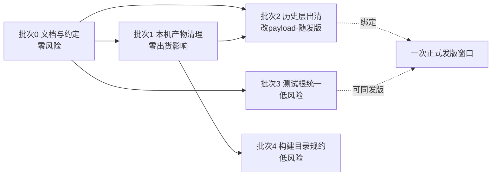
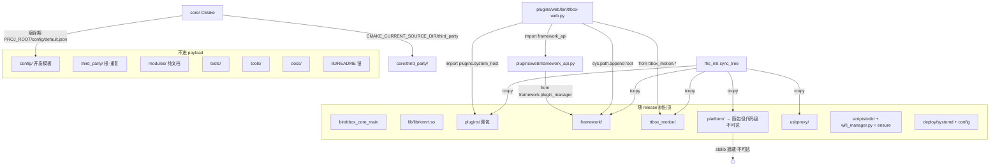
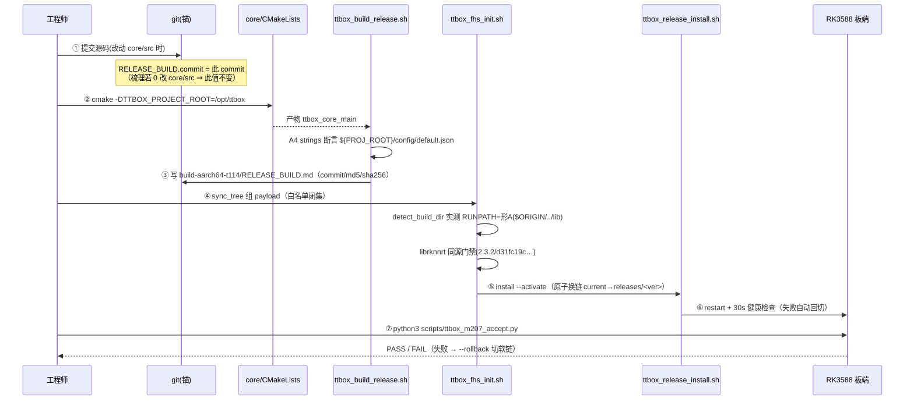

# TTBOX 代码梳理方案（2026-09-17）

> **作者**：高见远（架构师）
> **委托**：主理人齐活林 · 任务 #10
> **业主诉求**：「现在开始梳理整理代码，给我一个方案，要求**架构清晰明了，分类清晰**。」
> **交付物性质**：**方案（设计文档）**，不是动手改码。业主据此决定分批执行。
> **本文件是本任务唯一产出**；除本文件外**未修改/新增任何文件**，未提交 git。
> **基线锚**：git `dc5670c → 712ab67 → 70d07f7 → 1f7d624 → 7490668`（5 提交，工作区干净，无 remote）；板端出货 `releases/1.4.3`，core sha256 `3f760bc1c5e939feb98e148e0f9414ec6df073a9c25abe5af67468b872ffceb0`。
> **不可破坏约束**：梳理动作**不得**使上述可复现锚失效（见 §6）。

---

## 0. 摘要（TL;DR）

- **推荐分类维度**：顶层**按"消费方与生命周期"（artifact / lifecycle boundary）**划分，而非按"运行时分层"或"产品模块"——理由是**本仓库的硬约束全部落在"谁消费、何时消费、是否进 payload"这条边界上**（payload 白名单闭集、FHS release 树、编译期 `TTBOX_PROJECT_ROOT`、`scripts/` 路径锚定）。运行时分层维度**下沉到 `core/src/` 内部**继续使用（现状已经如此）。
- **顶层保留 12 个目录**，新增 0 个顶层目录；`modules/`、根 `third_party/`、根 `models/`、`platform/`、`plugins/web/static/legacy/`、`scripts/legacy/`、39 个根 `_*` 探针、7 个 build 目录中的 6 个 → **出清或归档**。
- **最高优先动作 = 批次 0（零风险）**：只做**文档与约定层**（写"目录契约"、治理 `docs/`、更新 `架构/目录结构.md`），**不物理移动任何文件**。因为**物理移动会改变 payload 与 `scripts/` 锚**，必须与一次正式发版绑定——**不应作为"整理"的起点**。
- **纠正主理人侦察 5 处偏差**（最关键：`framework/` **不是**死代码，是 web 的**运行期硬依赖**），见 §10。
- **待业主拍板 5 项**，见 §9。

---

## 1. 现状诊断（证据先行）

### 1.1 体量与构成（可复核）

| 指标 | 值 | 取证命令 |
|---|---|---|
| git 跟踪文件总数 | **704** | `git ls-files \| wc -l` |
| 工作区文件总数（含未入库构建产物） | ~1400+ | `find . -type f` |
| 顶层非目录文件 | 44（其中 **39 个为 `_*` 探针**） | `ls -1 *.* _*` |
| 构建目录 | **7 个**（根 6 + `core/build-host-m2`） | `find . -maxdepth 1 -name 'build*'` |
| `docs/` 文件 | 144（顶层 md **41**） | `find docs -type f` |

**语言总量（仅 git 跟踪）**：

| 语言 | 文件 | LOC |
|---|---:|---:|
| `.cpp` | 151 | 38,272 |
| `.hpp` | 107 | 8,315 |
| `.h` | 17 | 16,385 |
| `.c` | 1 | 120 |
| `.py` | 131 | 20,151 |
| `.sh` | 39 | 4,705 |
| `.js` | 7 | 14,597 |
| `.css` | 9 | 9,695 |
| `.html` | 5 | 1,595 |
| `.md` | 139 | 18,004 |

> 源码总量 ≈ **9.4 万行**；其中 **C++ 占 46%（4.3 万行）**、Python 21%、前端 JS/CSS 26%、Markdown 19%。
> ⚠️ **注意**：`.js`/`.css` 的 14.6k/9.7k 行里，**约 640KB（≈ 0 行计）来自 `plugins/web/static/legacy/` 这套已停用前端**（见 §1.2）。

### 1.2 各目录"活/死"分类（引用证据）

`引用数` 收集口径：在 `*.py / *.sh / *.cpp / *.hpp / *.h / *.txt / *.cmake` 中检索 `import X` / `from X` / `X/` 路径字面量，**排除自身目录**；`git` 口径为 `git ls-files <dir> | wc -l`。

| 目录 | 文件(净*)| tracked | 引用数 | 语义判定 | 判定证据（抽样复核过） |
|---|---:|---:|---:|---|---|
| `core/` | 1037 | 284 | — | **活·构建入口** | 全仓唯一 `CMakeLists.txt`（`core/CMakeLists.txt`）；`core/src` 165 文件 + `core/tests` 86 文件 |
| `core/third_party/` | 10 | 10 | — | **活·构建输入** | `core/CMakeLists.txt:197/258/564` 以 `CMAKE_CURRENT_SOURCE_DIR/third_party/rknn` 引用；`deploy/cmake/toolchain-aarch64.cmake:51` 以 `CMAKE_SOURCE_DIR/third_party/rknn` 引用（`CMAKE_SOURCE_DIR` = `core/`） |
| `usbproxy/` | 28 | 28 | 6 | **活·出货** | `ttbox_fhs_init.sh:385` `tcopy usbproxy`；预编译 ELF `usb-proxy` 入库（`.sha256` 声明 `bf8b98c6…`） |
| `plugins/` | 86 | 86 | — | **活·出货（整包）** | `ttbox_fhs_init.sh:377` `tcopy plugins`（注释：`framework_api.py` 需 `plugins.system_host`，只拷子目录会 `ModuleNotFoundError`） |
| `framework/` | **27** | 27 | **2（活）** | **活·运行期硬依赖** | `plugins/web/framework_api.py:13-14` `from framework.plugin_manager import …`；`plugins/web/bin/ttbox-web.py:40,1629` `import framework_api` + `install_framework_api(app)`；`ttbox_fhs_init.sh:380` 随包拷贝 |
| `ttbox_motion/` | **3** | 3 | **5（活）** | **活·运行期依赖** | `plugins/web/bin/ttbox-web.py:43-44`、`core/tools/pid_sim/tune_check.py:7`、`platform/tests/test_motion_*.py:3/6`；`ttbox_fhs_init.sh:381` 随包拷贝 |
| `platform/` | **38** | 38 | **0（代码）** | **疑死·随包空壳** | `ttbox_fhs_init.sh:382` 随包拷贝到 `/opt/ttbox/platform/`；但**全仓无 `import platform` / `from platform…`**（仅注释与文档提及）。且 `ttbox-web.py:33-37` 明示：`/opt/ttbox/platform/` 与 stdlib `platform` 同名，**必须让 stdlib 优先** ⇒ 该包被 `sys.path` 落在末尾，**运行期不可达** |
| `modules/` | 10 | 10 | **0** | **死·纯设计 README** | 10 个文件全是 `modules/0X-*/README.md`，无一行代码；无任何引用 |
| `third_party/`（根） | 2 | 2 | **0（指向根）** | **死·重复残留** | 仅 `rknn/rknn_api.h` + `rknn/rknn_matmul_api.h`；CMake **只认 `core/third_party/`**；`rknn_matmul_api.h` 在 `core/src`/`core/tests` 中**零消费者**（`grep -rn rknn_matmul core/` 为空） |
| `lib/` | 1 | 1 | 0 | **活·文档锚** | `lib/README.md` 是「库作用域裁决（lib-scope-ruling）」的**不变量锚**：`git ls-files 'lib/*.so*'` 必须为空 |
| `models/` | 0 | **0** | 0 | **死·空格** | 仅本机空目录 `models/installed/`；git 无跟踪；`.gitignore:97` 白名单指向**不存在的** `models/installed/jwdl_sjzv11/model.rknn` |
| `config/` | 6 | 6 | — | **活·开发模板** | 编译期常量 `TTBOX_PROJECT_ROOT "/config/default.json"`（`core/src/app/Application.cpp:52`）；`config/` 是**开发侧模板**，运行期真值在 `/opt/ttbox/config/` 与 `/etc/ttbox/`（两者是**两件事**） |
| `deploy/` | 15 | 15 | — | **活·部署输入** | `ttbox_fhs_init.sh:68/147/402/406` 引用 `deploy/config/*`、`deploy/systemd/*` |
| `scripts/` | **36** | 36 | — | **活·锚定不可移动** | `ttbox_fhs_init.sh:24` 以 `dirname $BASH_SOURCE/..` 反推 `REPO_ROOT`；引用 `scripts/ttbox_release_install.sh`、`scripts/ttbox_ensure_services.sh` |
| `tools/` | 9 | 9 | — | **活·离线工具** | 模型转换 / 许可签发 / OTA 签发（`.testkeys/` 私钥永不入库） |
| `tests/` | 10 | 10 | — | **活·集成脚本** | shell 集成/监控脚本（`tests/api/*.sh`、`tests/monitor/*.sh`） |

\* 净 = 排除 `__pycache__`/`*.pyc`。主理人给的 `framework=48 / platform=43 / scripts=39` 是**含 pyc 的裸计数**；净计数分别为 27 / 38 / 36。

**三处（实为六处）测试根分裂**：

| 测试根 | 形态 | 规模 | 被谁驱动 |
|---|---|---:|---|
| `core/tests/` | C++（CTest） | 86 tracked | `ctest`（README 记 **27 个 CTest**） |
| `framework/tests/` | pytest | 8 | `pyproject.toml` `testpaths` |
| `platform/tests/` | pytest | 10 | `pyproject.toml` `testpaths` |
| `plugins/web/tests/` | pytest | 8 | **未被 `testpaths` 覆盖** |
| `tests/` | shell 集成 | 10 | 手工 |
| `tools/{ota,license}/test_*.py` | pytest | 2 | 手工 |

### 1.3 六个"为什么现在不清晰"的**根因**（不是现象）

| # | 根因 | 证据 |
|---|---|---|
| **R1** | **历史层未出清**：项目历经"`TTBOX` → `TTBOX-模块版`"重构，旧层（`modules/` 设计先行文档、根 `third_party/`、`platform/` V1 骨架、`scripts/legacy/`、`static/legacy/`）**整体留在原位**，与新层同层并列 | `docs/整理前代码现状.md`、`docs/阶段1代码瘦身报告.md` 明写"工作区 `…/Desktop/TTBOX`"（**非** `-main`）；根 `third_party/` 与 `core/third_party/` 并存 |
| **R2** | **"设计文档先行、代码未落地"**：`modules/01-capture … 09-runtime` 是**只有 README 的目标架构视图**，与 `core/src/` 真实实现**双轨命名**（`modules/03-detector` vs `core/src/detector`+`core/src/rknn`）⇒ 读者不知道以谁为准 | `modules/` 10 文件全 0 引用；`docs/README.md:51` 把它列为"模块化语义视图" |
| **R3** | **单文件过大**：`ttbox-web.py` **5012 行 / 223KB** 单文件承载 100+ 路由；`api_v1.py` 851 行；`static/legacy/app.js` **461KB** 单文件 | `find plugins -printf '%s %p' \| sort -rn` 前 3 名 |
| **R4** | **测试根分裂且无统一入口**：Python 测试散在 **4 处**、shell 在 1 处、C++ 在 1 处；`pyproject.toml` 只覆盖 2 处，`plugins/web/tests/` **不在 `testpaths`** ⇒ "跑全量测试"没有单命令 | `pyproject.toml` `testpaths=[…]`；`plugins/web/tests/` 8 文件 |
| **R5** | **文档重叠、无唯一真源**：`docs/` 至少有 **10 份**互相重叠的"盘点/瘦身/架构/代码地图"报告，多份自称"最终/权威"，且**过半引用旧工作区路径** | 12 份文档 grep 命中 `Desktop/TTBOX`（旧路径）；§7 归并表 |
| **R6** | **临时探针与源码同层**：仓库根有 **39 个 `_*.txt/_*.sh/_*.tgz`** 抓取物 + `build-aarch64-t114-m203-gate.log` + 7 个 build 目录，**与源码平铺在同一层** | `ls -1 _*` = 39；`git status --ignored` 全为 `!!` |

> R1–R6 中，**R1/R2/R6 是"物理位置"问题**（可低风险出清），**R3/R4/R5 是"结构/约定"问题**（需治理但改码风险不同）。本方案据此把动作切成"零风险文档批"与"随发版批"。

---

## 2. 目标目录结构

### 2.1 分类维度的**取舍论证**（不和稀泥）

候选维度：

| 维度 | 代表 | 优点 | 致命缺点（针对本仓） | 结论 |
|---|---|---|---|---|
| **A. 运行时分层**（capture/infer/control/output） | `modules/` 想做的事 | 讲"数据流"最直观 | 顶层只有 1 个 `core/` 是 C++，其余是 Python/脚本/文档；按运行时切会把 `deploy/`、`docs/`、`tools/` 切碎，且与 CMake 源树**冲突** | ❌ 仅用于 `core/src/` **内部** |
| **B. 按产品模块** | 多产品线 | 产品隔离清晰 | 本仓**只做一个产品**（TTBOX 盒子），无模块可切 | ❌ 不适用 |
| **C. 按消费方与生命周期**（源码/部署/工具/文档/测试） | 本方案 | **与硬约束同构**：payload 白名单、FHS、`PROJ_ROOT`、`scripts/` 锚全部是"谁消费/是否进包"的边界 | 需要在 `core/src/` 内**再叠**一个维度 | ✅ **顶层采用，内部叠加 A** |
| D. 混合（C 顶层 + A 内层） | — | 兼顾 | — | ✅ **即 C 的落地形态** |

**推荐 = C（顶层）+ A（`core/src/` 内层）**。论证一句话：**本仓库真正的"架构"不是代码分层，而是"出货物边界"**——所有 8 条硬约束（§6）无一是关于"代码怎么写"的，全部是关于"什么进 release 树、路径被谁写死"。因此**顶层分类维度必须与出货边界一一对应**，否则每加一个文件都会触发"这该不该进包"的争议。

### 2.2 目标顶层树（保留 12 目录）

```text
TTBOX-Module-Edition/
├── core/            # ① 构建输入·C++ 唯一源树（唯一 CMakeLists.txt；含 core/third_party）
│   ├── src/         #    生产源码（内层按运行时分层：capture/rga/rknn/aim/mouse/output/…）
│   ├── include/     #    对外头（CoreInterface.hpp / version.hpp）
│   ├── tests/       #    C++ 单测 + 真机脚本（CTest 注册）
│   ├── tools/       #    板端工具 + 本机仿真（pid_sim/ipc_*/hid_*/win_core_main）
│   ├── third_party/ #    第三方头（rknn/ + onnxruntime/）——构建输入，勿动
│   └── CMakeLists.txt
├── usbproxy/        # ② 出货·鼠标注入代理（独立手写 Makefile + 预编译 ELF）
├── plugins/         # ③ 出货·运行期插件包（整包拷贝；web 最重）
├── framework/       # ④ 出货·运行期领域包（插件管理框架，web 硬依赖）
├── ttbox_motion/    # ⑤ 出货·运行期领域包（运动校准/训练，web + core/tools 依赖）
├── config/          # ⑥ 开发侧配置模板（运行期真值在 /opt/ttbox/config、/etc/ttbox）
├── deploy/          # ⑦ 部署输入（systemd unit / toolchain / 出厂配置 / DEPENDENCIES）
├── scripts/         # ⑧ 构建·发布·运维脚本 + edid 工具链（★FHS 锚定，不可移动）
├── tools/           # ⑨ 离线开发工具（模型转换 / 许可签发 / OTA 签发）
├── tests/           # ⑩ 跨模块集成与板端验收脚本（shell/py）
├── docs/            # ⑪ 唯一文档中心（见 §7 分类）
├── lib/             # ⑫ 库作用域裁决锚（README 即不变量，实体 .so 已按丙案删除）
├── .gitignore / .gitattributes / LICENSE / README.md / pyproject.toml
└── build-aarch64-t114/RELEASE_BUILD.md   # ← 唯一入库的构建留档（见 §6）
```

**关键设计点**：
1. **不新增任何顶层目录**——现有 12 个顶层目录的职责边界**已经基本正确**；问题不在"缺目录"，在"错位的文件没归位"。新增顶层目录只会继续扩大"该放哪"的自由度。
2. `framework/`、`ttbox_motion/`、`platform/` 三个 Python 领域包**留在顶层**（而非收进 `core/`）是对的：`ttbox-web.py:38` 用 `sys.path.append(repo_root)` 把它们当**根级包**加载，且 FHS 随包拷贝也落在 `/opt/ttbox/<pkg>/`。**除非同步改动 web + fhs_init，否则物理位置不可动**。
3. `core/third_party/` 保留在 `core/` 内（构建源树自包含），根 `third_party/` 出清。

### 2.3 各目录一句话职责

| 目录 | 一句话职责 | 是否进 payload |
|---|---|:--:|
| `core/` | C++ AI 核心的唯一构建源树（采集→推理→瞄准→输出） | 仅 `bin/ttbox_core_main` |
| `core/third_party/` | 编译期第三方头文件（rknn + onnxruntime） | ❌ |
| `usbproxy/` | Raw Gadget 鼠标注入代理（含预编译 ELF） | ✅ 整包 |
| `plugins/` | Python 插件包（fan/log/model/monitor/network/preview/system/upgrade/web/wifi） | ✅ 整包 |
| `framework/` | 插件管理框架（discovery/install/integrity/lifecycle/registry/repository） | ✅ 整包 |
| `ttbox_motion/` | 运动曲线校准与训练（calibration/training） | ✅ 整包 |
| `config/` | 开发侧配置模板（default/hardware_display/edid/yolo/cloud.example） | ❌（`deploy/config/` 才进） |
| `deploy/` | 部署基础设施（systemd、toolchain、出厂配置、依赖说明） | 仅 `systemd/*` + `config/{00-factory,hardware_display}.json` |
| `scripts/` | 构建/发布/运维脚本 + edid 工具链（REPO_ROOT 反推锚点） | 仅 `edid/`+`wifi_manager.py`+`ttbox_ensure_services.sh` |
| `tools/` | 离线开发工具（ONNX→RKNN、许可/OTA 签发） | ❌ |
| `tests/` | 板端集成/监控/API 验收脚本 | ❌ |
| `docs/` | 唯一文档中心 | ❌ |
| `lib/` | 库作用域裁决锚（README 即不变量） | ❌（真值来自构建机 sysroot） |

---

## 3. 分类规则与"放哪"判定树

### 3.1 新增文件时的**顺序判定**（按此顺序问，命中即停）

| 序 | 自问 | 命中 → 落点 |
|---|---|---|
| 1 | 它是 **C++ 源码** 吗？ | `core/src/<层>/`（层见 §2.2；跨模块接口进 `core/include/ttbox/core/`） |
| 2 | 它是 **C++ 的测试/工具** 吗？ | 单测 `core/tests/`；板端/仿真工具 `core/tools/` |
| 3 | 它是 **随包运行的 Python** 吗（被 web/core/fhs 运行期加载）？ | 插件 `plugins/<name>/`；框架 `framework/`；运动 `ttbox_motion/` |
| 4 | 它是 **构建/发布/运维脚本**，且被 FHS 或发布门禁引用？ | `scripts/`（★**不得**外移；若被 fhs 引用还要同步 fhs_init） |
| 5 | 它是 **离线/开发期工具**（不在板端跑）？ | `tools/`（模型转换/签发类） |
| 6 | 它是 **部署描述**（unit/toolchain/出厂配置）？ | `deploy/{systemd,cmake,config}/` |
| 7 | 它是 **配置模板** 吗？ | 开发模板 `config/`；出厂基线 `deploy/config/`；**运行期真值不在仓库** |
| 8 | 它是 **测试** 吗？ | C++→`core/tests/`；pytest→**就近包内 `tests/`**；跨模块/板端→`tests/` |
| 9 | 它是 **文档** 吗？ | `docs/<类别>/`（类别见 §7.3） |
| 10 | 以上都不是（一次性的探针/抓取物/构建产物） | **不进库**：构建产物→build 目录（已被 `.gitignore` 覆盖）；探针→**不要落在仓库根**，用临时目录 |

### 3.2 决策树（Mermaid）

```mermaid
flowchart TD
  A[新文件] --> B{C++ 源码/测试?}
  B -- 源码 --> B1[core/src/层/]
  B -- 测试 --> B2[core/tests/]
  B -- 工具 --> B3[core/tools/]
  B -- 否 --> C{随包运行?}
  C -- 插件 --> C1[plugins/name/]
  C -- 框架/领域包 --> C2[framework/ 或 ttbox_motion/]
  C -- 否 --> D{被 FHS/发布门禁引用?}
  D -- 构建/发布/运维脚本 --> D1[scripts/  不可外移]
  D -- 部署描述 --> D2[deploy/  systemd|cmake|config]
  D -- 否 --> E{离线工具?}
  E -- 是 --> E1[tools/]
  E -- 否 --> F{测试?}
  F -- pytest --> F1[就近包内 tests/]
  F -- 跨模块/板端 --> F2[tests/]
  F -- 否 --> G{文档?}
  G -- 是 --> G1[docs/类别/]
  G -- 否 --> H[不入库: 构建产物/pycache/探针/凭据]
```

### 3.3 命名约定（**强制**）

| 对象 | 规则 | 反例（现状） |
|---|---|---|
| 目录名（代码包） | 小写、`snake_case`、单数；包必有 `__init__.py` | ✅ 现状合规 |
| 目录名（文档） | 小写英文 `kebab-case` 主题名（`architecture/ops/protocols/…`） | ❌ 现状 `架构/`、`小白教程/`、`开发/`、`验证/` 中英混用 |
| C++ 文件 | 类名同 `PascalCase.hpp/.cpp`；实现类与接口分离（`Xxx.hpp` / `Xxx_stub.cpp`） | ✅ 现状合规 |
| 插件 | `plugins/<name>/{bin/{ttbox-<name>, ttbox-<name>.py},config/,…}`；`bin/ttbox-<name>` 为**bash launcher** | ✅ 现状合规（`plugins/web/bin/ttbox-web`） |
| pytest 文件 | `test_*.py`，就近包内 `tests/` | ✅；但 `tools/{ota,license}/test_*.py` 应趋同 |
| C++ 测试 | `test_*.cpp`（CTest 注册名 = 去掉 `test_`） | ✅ |
| shell 测试 | `test_*.sh`；集成脚本按域分目录 `tests/<域>/` | ✅ |
| 文档命名 | **活的真源**：`主题.md`（如 `架构/系统总览.md`）；**一次性报告**：`主题-YYYY-MM-DD.md`；**版本化**：`主题-vX.Y.Z.md` | ❌ 现状 `M2.07.1-交付总结-2026-09-17.md`（好）vs `code-inventory-v0.0.1.md`（旧）、`整理前代码现状.md`（无日期） |
| 日期格式 | `YYYY-MM-DD`（ISO，本地日） | ✅ |
| 私有/临时 | 一律不入库（`.testkeys/`、`_*`、`*.local.json`、`*.log`） | ✅ `.gitignore` 已覆盖 |

---

## 4. 五档处置清单（逐项给理由与风险）

档位定义：**保留** = 位置与职责都不动；**移动** = 换位置但保留内容；**合并** = 内容并入他处；**归档** = 移入只读归档区（`docs/archive/` 或 git 历史），不再维护；**删除** = 直接移除。

### 4.1 顶层与模块级

| # | 对象 | 现状 | **处置** | 理由 | 风险 |
|---|---|---|---|---|---|
| 1 | `core/` | C++ 源树，唯一 CMake | **保留** | 构建入口，全仓核心 | — |
| 2 | `core/third_party/` | rknn + onnxruntime 头 | **保留** | CMake 唯一定位处（`CMAKE_CURRENT_SOURCE_DIR/third_party`） | 移动会断交叉构建 |
| 3 | `core/tools/` | 20 文件（板端工具+仿真） | **保留** | 被 `core/tests`、`pid_sim`、真机流程引用 | — |
| 4 | `core/src/bench/npu_bench.cpp` | 单文件基准 | **保留**（可选后续 `Move`→`core/tools/bench/`） | 属 core 构建或工具，二义性低；本方案**不动** | 低 |
| 5 | `core/build-host-m2/` | **27MB** 构建产物在源树内 | **删除** | 构建产物，`.gitignore:35` 已覆盖；在源树内污染 grep/搜索 | 零（可重建） |
| 6 | `usbproxy/` | 代理源码 + 预编译 ELF | **保留** | 出货必需；ELF 入库是既定设计（`usb-proxy.sha256` 校验） | ⚠️ **勿当垃圾清**（预编译 ELF 无 shebang） |
| 7 | `plugins/` | 10 插件，整包出货 | **保留** | 整包拷贝（web 需 `plugins.system_host`） | 移动会断 web 启动 |
| 8 | `plugins/web/static/legacy/` | 9 文件 ~640KB 旧前端 | **归档**（移出 `plugins/`） | **零引用**（模板/JS 均不引用）；仍随 plugins **整包进 payload** ⇒ 白占发布体积 + 泄露面 | ⚠️ **改 payload**，需随发版并重跑 manifest 门禁 |
| 9 | `plugins/web/bin/ttbox-web.py` | 5012 行单文件 | **保留（登记为技术债）** | 拆分收益大但风险高、且不在"梳理"范围 | 拆分=功能改动，**本方案不动** |
| 10 | `framework/` | 插件管理框架 27 文件 | **保留** | **活依赖**（web `framework_api` 硬引用） | ⚠️ 若按主理人"引用 0"误删 → **web 启动即崩** |
| 11 | `ttbox_motion/` | 校准/训练 3 文件 | **保留** | **活依赖**（web + core/tools） | 同上 |
| 12 | `platform/` | 38 文件，随包但不可达 | **归档 → 待实测确认后删除** | `sys.path` 末尾 + stdlib 同名 ⇒ 运行期**结构不可达**；README 自称"未接入链路"；随包拷贝纯属空壳 | ⚠️ 改 payload；**须先实测确认"无任何动态加载"**（见 §5 批次2 验收） |
| 13 | `modules/` | 10 个 README，0 引用 | **归档**（内容并入 `docs/architecture/`） | 设计先行文档，与 `core/src/` 双轨命名，误导读者 | 零（纯文档） |
| 14 | `third_party/`（根） | rknn 2 头，0 引用（指向根） | **删除** | 与 `core/third_party/` **重复**；CMake 不认根副本；`rknn_matmul_api.h` 零消费者 | 零（需确认无外部脚本引用；已复核仅 `.workbuddy` 探针提及） |
| 15 | `lib/` | 仅 README（作用域裁决） | **保留** | README 是**不变量锚**；`git ls-files 'lib/*.so*'` 必须为空 | ⚠️ 删目录会丢失裁决口径 |
| 16 | `models/`（根） | 空目录 | **删除**（本机清理） | git 未跟踪；`.gitignore:97` 白名单指向不存在文件；运行期模型在 `/var/lib/ttbox/models` | 零 |
| 17 | `config/` | 6 模板 | **保留** | 编译期路径模板（`PROJ_ROOT/config/default.json`） | 移动会与 A4 门禁 `strings` 断言冲突 |
| 18 | `deploy/` | systemd/toolchain/出厂配置 | **保留** | 部署输入 | — |
| 19 | `scripts/` | 36 脚本 + edid 工具链 | **保留·不可移动** | `REPO_ROOT` 反推 + `scripts/*` 硬引用 | ⚠️⚠️ **移动 = 断部署链路**（§6-2） |
| 20 | `scripts/legacy/ttbox_m2_license_accept_v1_authflow.py` | 单文件旧流程 | **归档** | `legacy/` 命名自证废弃 | 低（先复核无引用） |
| 21 | `tools/` | 9 文件 | **保留** | 离线工具链 | — |
| 22 | `tests/` | 10 shell | **保留**（并纳入统一测试入口） | 板端验收，真实在用 | 低 |
| 23 | 根 39 个 `_*`（`_*.txt/_*.sh/_*.tgz`） | 探针抓取物 | **删除** | 未入库（`.gitignore:211-213`）；无长期价值 | 零（不在库内） |
| 24 | `build-aarch64-t114-m203-gate.log` | 门禁日志 | **归档 → `docs/handover/2026-09-17/evidence/`** 或删除 | 24KB 历史门禁输出，有取证价值 | 零 |
| 25 | `preview_server.py` | 本机预览启动器 | **移动 → `tools/`** | 开发期工具，不该占仓库根 | 低（复核无引用） |
| 26 | `pyproject.toml` | 包/测试配置 | **保留**（修 `testpaths`） | 是 pytest 唯一入口 | — |
| 27 | `build-aarch64/`（陈旧近似形A） | 7.9MB，0 tracked | **删除** | 与 `build-aarch64-t114` 近似同名，曾致误选（M2.07/M2.07.1 各踩一次） | 零；删除反而**降低误选风险** |
| 28 | `build-aarch64-authon/`、`build-aarch64-t118/`、`build-host-yu/` | 构建产物 | **删除** | 0 tracked，纯产物 | 零（可重建） |
| 29 | `build-aarch64-t114/RELEASE_BUILD.md` | 出货留档（commit=70d07f7…） | **保留** | 可复现锚的一半 | ⚠️ **禁改**（脚本自动生成，手改无效） |
| 30 | `build-aarch64-deploy/RELEASE_BUILD.md` | 留档（`commit=HEAD\nunknown`） | **保留** | 留档即便残缺也是历史证据 | ⚠️ 禁改 |
| 31 | `.pytest_cache/`、`.workbuddy/` | 缓存/会话 | **删除本机** | `.gitignore` 已覆盖 | 零 |
| 32 | `docs/`（41 顶层 md + 子目录） | 重叠严重 | **治理**（见 §7） | 见 §7 | 见 §7 |

### 4.2 处置统计

| 档位 | 项数 | 主要对象 |
|---|---:|---|
| **保留** | **16** | core、core/third_party、core/tools、usbproxy、plugins、framework、ttbox_motion、lib、config、deploy、scripts、tools、tests、2 份 RELEASE_BUILD.md、pyproject.toml |
| **移动** | **1** | `preview_server.py` → `tools/` |
| **合并** | **1**（+1 测试合并） | `modules/` 内容并入 `docs/architecture/`；测试入口合并（§7/§5-T3） |
| **归档** | **4** | `plugins/web/static/legacy/`、`platform/`、`scripts/legacy/`、`build-*.log` |
| **删除** | **9**（+1 空目录） | 根 `third_party/`、`core/build-host-m2/`、`build-aarch64/`、`build-aarch64-authon/`、`build-aarch64-t118/`、`build-host-yu/`、39 个根 `_*`、`models/`（本机）、`.pytest_cache/`/.workbuddy（本机） |
| 有条件（待实测后再定） | 1 | `platform/` 归档→删除 |

---

## 5. 分批迁移计划

**核心原则**：
1. **低风险先行**；每批**独立可回滚**；**绝不让出货链路处于半迁移状态**。
2. **"物理移动 vs 只改文档与约定"必须先分清**——因为**物理移动 = 改 payload / 改 `scripts/` 锚 / 改随包路径**，本质上**等同于一次发布变更**；而**文档与约定层是零风险**。
3. ⇒ **推荐把"只做文档与约定层（零风险）"列为第 0 批并先执行**；任何物理移动**与一次正式发版绑定**，不单独做。

### 批次 0 —— 文档与约定层（**零风险，推荐先做**）

| 项 | 内容 |
|---|---|
| **前置** | 无 |
| **动作** | ① 写《目录契约》= 本方案 §2/§3 落为 `docs/architecture/目录结构.md`（刷新为**现况 + 约定**）；② 执行 §7 文档治理（归档/合并/建分类目录）；③ 在 `README.md` §四目录结构补"职责 + 是否进 payload"两列；④ 在 `docs/README.md` 增"文档唯一真源表" |
| **不做什么** | **不复制、不移动、不删除任何代码/脚本/配置**；不改 `core/`、`plugins/`、`scripts/` 一个字节 |
| **验收** | `git diff --stat` 只含 `docs/**` 与 `README.md`；`git ls-files core plugins usbproxy scripts deploy` 不变；`ctest -N` 不变 |
| **回滚** | `git checkout -- <docs>` 或 `git revert` |
| **为什么先做** | 零风险 + 立即解决 R2/R5（文档双轨、无真源）；且它是后续所有物理移动的**判据来源** |

### 批次 1 —— 本机产物清理（**零出货影响**）

| 项 | 内容 |
|---|---|
| **前置** | 批次 0（不强制，但建议） |
| **动作** | 删除 39 个根 `_*`；删 `build-aarch64-m203-gate.log`（或移证）；删空目录 `models/`；删 `core/build-host-m2/`、`build-aarch64/`、`build-aarch64-authon/`、`build-aarch64-t118/`、`build-host-yu/`；清 `.pytest_cache/`；**保留** `build-aarch64-t114/RELEASE_BUILD.md` 与 `build-aarch64-deploy/RELEASE_BUILD.md` |
| **关键判据** | 删除前逐项 `git ls-files <path>` **必须为空**（否则会杀掉入库文件） |
| **验收** | `git status --short` 干净；`git ls-files \| wc -l` **仍 = 704**；`git ls-files 'build-aarch64*'` 仍返回 2 条 |
| **回滚** | 本批删的都是**未跟踪+可重建**产物，无需回滚（重跑构建即得） |
| **风险** | 极低。**唯一雷点**：误删 `build-aarch64-t114/`（内含入库的 `RELEASE_BUILD.md`）——须**整目录保留**，只清目录内其他产物 |

### 批次 2 —— 历史层出清（**改 payload ⇒ 必须随发版**）

| 项 | 内容 |
|---|---|
| **前置** | 批次 0/1；**一次正式发版窗口**；`scripts/ttbox_m207_accept.py` 基线全绿 |
| **动作** | ① 归档 `plugins/web/static/legacy/`（移出 `plugins/`）；② 归档 `platform/`；③ 删根 `third_party/`；④ 归档 `scripts/legacy/` |
| **强制验证（platform 删除前）** | 在板端实测：`python3 -c "import platform,sys;print(platform.__file__)"` 应指向 **stdlib**；并在 `/opt/ttbox` 下 `grep -rn "from platform\|import platform\|platform\.config\|platform\.supervisor" ` 为空 ⇒ 证"结构不可达"，方可删 |
| **验收命令** | 本机：`cmake --build build-win && ctest --test-dir build-win`（core **全绿**，且 **core/src 零改动** ⇒ `RELEASE_BUILD.md` 的 `commit` 语义**不受影响**）；交叉：`bash scripts/ttbox_fhs_init.sh <ver>`（payload 重建 + manifest）；门禁：`python3 scripts/ttbox_m207_accept.py`；发布体检：`bash scripts/ttbox_release_verify.sh` |
| **回滚** | payload 变了 ⇒ **用 `scripts/ttbox_release_install.sh --rollback` 切回上一版软链**；源码层用 `git revert` |
| **风险** | 🟡 **中**。改 payload 会影响 `RELEASE_MANIFEST.files_sha256`；`platform/` 若被某条动态路径加载则 web 崩。**故必须与一次发版绑定并跑完整门禁**，禁止在两次发版之间做 |

### 批次 3 —— 测试根统一（**低风险，可与批次 2 同发版**）

| 项 | 内容 |
|---|---|
| **前置** | 批次 0 |
| **动作** | `pyproject.toml` 的 `testpaths` 补 `plugins/web/tests`（并评估 `tools/*/test_*.py`）；`tests/` 收敛为"板端集成"目录，补一个 `README` 说明它**不是**单元测试；README「测试」节给**统一入口** |
| **验收** | `python -m pytest -q`（覆盖 4 处 py 测试）；`cd core && ctest -N` 计数不变 |
| **回滚** | `git revert`（仅 `pyproject.toml` + 文档） |
| **风险** | 低（仅测试采集面） |

### 批次 4 —— 构建目录命名规约（低风险）

| 项 | 内容 |
|---|---|
| **前置** | 批次 1 |
| **动作** | 文档化 `detect_build_dir` 的候选顺序与"形 A"判据（`docs/build/` 已有 `build-reproducibility.md`，补一节）；**不删 `build-aarch64-t114`**；说明"陈旧同名近似目录"已被批次 1 清掉 |
| **验收** | `git check-ignore -v build-aarch64-t114/RELEASE_BUILD.md` 无输出；`git check-ignore -v docs/build/build-reproducibility.md` 无输出 |
| **回滚** | 文档改动 |
| **风险** | 零 |

### 5.1 批次依赖图



> **注意**：批次 2/3 若与发版解耦执行，会让仓库处于"源码已变、板端未发"的**半迁移态**——本方案**明确反对**。若业主不希望近期发版，则**只做批次 0/1/4**（全部零出货影响），把批次 2/3 挂到下一次发版。

---

## 6. 硬约束清单（"动哪条会炸什么"护栏）

| # | 约束 | 动它的后果 | 梳理动作必须遵守 |
|---|---|---|---|
| **C1** | `TTBOX_PROJECT_ROOT` 是**编译期常量**（`-DTTBOX_PROJECT_ROOT=/opt/ttbox`），非运行期 `getenv` | 改成运行期解析 / 移动 `config/` ⇒ A4 门禁 `strings` 断言 `${PROJ_ROOT}/config/default.json` 失败 ⇒ **拒绝出货** | `config/` **位置不动**；"源码里的 config/" ≠ "运行期 /opt/ttbox/config/" 两件事勿混 |
| **C2** | `ttbox_fhs_init.sh:24` 用 `dirname $BASH_SOURCE/..` 反推 `REPO_ROOT` | **移动 `scripts/`** ⇒ 断 `deploy/config/`、`scripts/ttbox_release_install.sh`、`scripts/ttbox_ensure_services.sh` 全部解析 ⇒ **部署链路断** | `scripts/` **绝不外移**；若 fhs 引用的脚本要改名，**fhs_init 同步改** |
| **C3** | release 树 + `current` 软链（`/opt/ttbox/releases/<ver>`） | 打乱布局 / 不走 install ⇒ 回滚（切软链）失效 | 梳理**不触碰** `releases/` 结构 |
| **C4** | `detect_build_dir()` 判据 = **实测 RUNPATH 恰为 `$ORIGIN/../lib`**（形 A），非目录名先到先得；候选顺序**硬编码** `build-aarch64-t114 build-aarch64 build` | 留陈旧同名近似目录 ⇒ 误选非形 A 产物 ⇒ **静默绕过 T1.16**（形 C 去共享目录找 .so） | 保留 `build-aarch64-t114`；**清掉陈旧近似目录**（批次 1）**降低**风险 |
| **C5** | `.gitignore` 大量**精心白名单**（last-match-wins；父目录被排除时无法再包含其内文件） | 随手改 `.gitignore` ⇒ 静默失效（如 `!lib/librknnrt.so`、`!usbproxy/Makefile`、`!docs/build/`、`_*` 须**根锚定**） | 梳理**不改 `.gitignore` 规则语义**；若必须改，逐条跑 `git check-ignore -v` 自检 |
| **C6** | `RELEASE_BUILD.md` 的 `commit` 字段语义 = **被编译的源码 commit** | 先构建后提交 / 手改留档 ⇒ 破坏 (源码, 向量) 二元组 ⇒ 复现锚失效 | **禁改**两份 `RELEASE_BUILD.md`；批次 2 **零 `core/src` 改动** ⇒ 该字段语义不受影响 |
| **C7** | `plugins/` 必须**整包拷贝**（web 需 `import plugins.system_host`） | 只拷子目录 ⇒ release 树 `plugins` 包残缺 ⇒ **web 启动 `ModuleNotFoundError`** | 若归档 `static/legacy/`，**保留 `plugins/__init__.py` 与 `system_host.py`/`system_common.py`** |
| **C8** | 预编译 ELF（无 shebang）须**显式赋可执行位**（MSYS/Git-Bash 判其非可执行）；`usbproxy/usb-proxy` 是入库 ELF（134K） | 当垃圾清 / 改其 mode ⇒ 板端 `run-ttbox-usb-proxy.sh` 预检 `exit 1` ⇒ 服务反复重启 | **勿清 `usbproxy/usb-proxy`**；勿改入库文件 mode（`ttbox_git_mode_check.sh` 有断言） |

---

## 7. 文档治理子方案

### 7.1 问题量化

- `docs/` 顶层 **41 份 md** + 子目录；其中**至少 10 份**是互相重叠的"盘点/瘦身/架构/代码地图"报告。
- **12 份**文档仍引用**旧工作区路径** `…/Desktop/TTBOX`（非 `-main`）⇒ 内容多为**重构前快照**。
- 多份自称"最终/权威"（`final-system-map.md`、`TTBOX_CODE_MAP_CN.md`、`TTBOX架构重构报告.md`），读者无从判断真源。

### 7.2 唯一真源归并表

| 现存文档 | 处置 | 归并去向 / 理由 |
|---|---|---|
| `README.md`（根） | **保留·真源** | 项目总入口（含目录结构、链路、构建） |
| `docs/README.md` | **保留·真源** | 文档总入口（改为"唯一真源表"驱动） |
| `docs/架构/系统总览.md` `完整链路.md` `核心模块.md` `数据流.md` `插件系统.md` | **保留·真源（5 份）** | 现役架构文档 |
| `docs/架构/目录结构.md` | **保留·刷新** | 现仍列 `platform/` 等，**改为本方案 §2 的目标树 + 是否进 payload** |
| `docs/RK3588开发流程.md`、`docs/ipc-protocol.md`、`docs/测试说明.md`、`docs/问题排查.md`、`docs/image-spec.md`、`deploy/DEPENDENCIES.md`、`lib/README.md` | **保留·真源** | 协议/流程/规格/依赖/作用域裁决各一真源 |
| `docs/废弃代码清单.md` | **保留·真源（唯一）** | "死代码"唯一判据表；吸收 `stage1` 清单结论 |
| `docs/整理前代码现状.md`、`docs/阶段1代码瘦身清理清单.md`、`docs/TTBOX阶段1代码瘦身报告.md`、`docs/TTBOX架构重构报告.md`、`docs/code-inventory-v0.0.1.md`、`docs/代码资产盘点-20260913.md` | **归档** | 阶段性历史快照（多引用旧工作区），移入 `docs/archive/` |
| `docs/core-code-health.md`、`docs/final-system-map.md`、`docs/TTBOX_CODE_MAP_CN.md`、`docs/zero-copy-audit.md`、`docs/参考行为映射.md` | **归档或合并** | 时点快照；可并入 `docs/architecture/` 或归档 |
| `docs/performance-rk3588*.md`（**8 份**） | **归档** | 历史性能报告，归 `docs/archive/performance/` |
| `docs/a9-*.md`（3 份）、`docs/a10/`、`docs/nightly/`、`docs/delivery/` | **归档** | 阶段交付物，已在 `docs/README.md` 标"历史归档" |
| `docs/第13/14/15阶段*.md`、`docs/PID真实数据分析报告.md`、`docs/int8-model-switch.md` | **归档** | 阶段报告 |
| `docs/小白教程/`（10 份）、`docs/小白使用说明.md` | **保留·真源** | 面向用户，活文档 |
| `docs/web/**`（19）、`docs/product/**`（10）、`docs/AI/**` | **保留**（按 §7.3 归位） | 分域文档 |
| `docs/handover/2026-09-17/**`（38） | **保留·不可改写** | **历史交接记录：只能追加或归档，禁改写** |

### 7.3 文档目录的目标分类 + 命名规范

```text
docs/
├── README.md            # 文档总入口 + 唯一真源表
├── architecture/        # 活·架构真源（系统总览/完整链路/核心模块/数据流/插件系统/目录结构）
├── protocols/           # 活·协议与规格（ipc-protocol、image-spec）
├── ops/                 # 活·运维（问题排查、部署、依赖、RK3588开发流程）
├── guide/               # 活·面向使用者（小白教程/、小白使用说明）
├── web/                 # 分域（architecture/ e2e/ model/ preview/ verification/）
├── product/             # 产品/蓝图/特性
├── performance/         # 性能报告（--YYYY-MM-DD.md 命名）
├── build/               # 构建可复现（build-reproducibility.md，白名单已存在）
├── handover/YYYY-MM-DD/ # ★历史交接（**只追加/归档，禁改写**）
└── archive/             # ★只读归档（重构前快照/阶段报告/旧盘点）
    ├── pre-refactor/    #   整理前/瘦身/重构报告
    ├── performance/     #   旧性能报告
    └── stages/          #   第N阶段/a9/a10/nightly/delivery
```

**命名规范**：活真源 `主题.md`；一次性报告 `主题-YYYY-MM-DD.md`；版本化 `主题-vX.Y.Z.md`。**目录名统一英文 `kebab-case`**（消除 `架构/`、`小白教程/` 的中英混用——迁移到 `architecture/`、`guide/`）。

> ⚠️ **迁移 `docs/` 子目录名会断链**：`docs/README.md`、根 `README.md`、`deploy/DEPENDENCIES.md` 内有大量相对链接。故 **§7.3 的目录改名属"批次 2/3"**（随发版），批次 0 只做**文件级归档与真源表**（不改目录名，用 `git mv` 保链接可查）。

---

## 8. 风险与"不建议动"清单

| 对象 | 建议 | 理由 |
|---|---|---|
| **`scripts/` 的任何移动/改名** | ❌ **强烈不建议** | C2：`REPO_ROOT` 反推 + 硬引用 3 处 ⇒ 一刀断部署链路，收益（"更好看"）为 0 |
| **`plugins/web/bin/ttbox-web.py`（5012 行）拆分** | ❌ **不建议（本阶段）** | 拆分=功能重构，非"梳理"；单文件虽大，但它是**出货稳定面**，改动风险远高于收益 |
| **`framework/` / `ttbox_motion/` 物理移动** | ❌ **不建议** | 二者是 web 的**运行期根级包**（`sys.path.append(repo_root)` + FHS 落 `/opt/ttbox/<pkg>/`）；移动需同步改 web + fhs_init，纯折腾 |
| **`config/` 与 `deploy/config/` 合并** | ❌ **不建议** | 两者作用域不同（开发模板 vs 出厂基线），且 C1 的编译期路径断言依赖 `config/` |
| **改 `.gitignore` 现有规则** | ❌ **不建议** | C5：白名单是 last-match-wins 的精巧设计，随手改会静默失效 |
| **`core/` 内部分层目录改名** | ❌ **不建议** | `core/src/{capture,rknn,aim,…}` 是 CMake 源列表 + 大量 `#include` 路径依赖；改名=大范围编译改动，零收益 |
| **`lib/README.md` 删除** | ❌ **不建议** | 它是库作用域**不变量锚**（README 即裁决），删了会重新出现"误拷 1.5.2"风险 |
| **`docs/handover/**` 改写** | ❌ **不建议** | 历史交接记录，只能追加/归档 |
| **`platform/` 立即删除** | ⚠️ **暂缓** | 虽"结构不可达"，但**先实测**（§5 批次2 验收）再删；且删=改 payload，须随发版 |
| **`build-aarch64-t114/` 目录整体清理** | ❌ **不建议** | 内含入库的 `RELEASE_BUILD.md`（锚的一半）；只清目录内其他产物 |
| **`usbproxy/usb-proxy`（预编译 ELF）** | ❌ **不建议** | C8：入库预编译 ELF 是既定设计；误清会导致板端服务挂 |
| **`core/src/bench/` 立即外移 `core/tools/`** | ⚠️ **暂缓** | 收益低（1 文件）而需动 CMake；**列批次4 可选**，不强制 |

**"动了收益低但风险高"的典型 = `ttbox-web.py` 拆分、`scripts/` 归并、`core/src` 改名**——本方案**一律列为"不建议"**。

---

## 9. 待业主拍板项（5 条）

| # | 决策点 | 选项 | **架构师推荐** |
|---|---|---|---|
| **P1** | 是否接受**物理移动**文件（`static/legacy/`、`platform/`、根 `third_party/`、`preview_server.py`） | A. 全做（随发版） / B. 只做零风险的文档层 | **B 优先，A 挂下一次发版**。理由：物理移动改 payload，本质是发布变更，不该混入"整理" |
| **P2** | 是否**删除历史层** `platform/`（38 文件，随包但不可达） | A. 归档并保留 / B. 归档后删除 | **B（先实测再删）**。理由：随包空壳 + stdlib 同名是结构性隐患；但须先跑 §5 批次2 验收 |
| **P3** | 是否**统一测试根**（`testpaths` 补 `plugins/web/tests`；`tests/` 定为集成根） | A. 统一 / B. 维持现状 | **A**。理由：R4，"跑全量测试"当前无单命令 |
| **P4** | 是否允许**改 `docs/` 子目录名**（`架构/`→`architecture/` 等） | A. 改（随发版） / B. 只归档不改名 | **B（批次0）→ A（随发版）**。理由：改目录名会断大量相对链接，须同步改链接 |
| **P5** | **出货节奏**：近期是否有发版窗口可绑定批次 2/3 | A. 有 / B. 无 | 若无 ⇒ **只执行批次 0/1/4**（零出货影响），其余挂起 |

---

## 10. 与主理人侦察数据的**不一致点**（以我的复核为准）

| # | 主理人结论 | 我的复核 | 影响 |
|---|---|---|---|
| **D1** | `framework/` **引用 0** | ❌ **错**。`framework` 是 **web 的运行期硬依赖**：`plugins/web/framework_api.py:13-14` `from framework.plugin_manager import …`；`ttbox-web.py:40,1629` `install_framework_api(app)`；`ttbox_fhs_init.sh:380` 随包拷贝。**引用数 = 2（代码级）** | 🔴 **关键**：若按"引用 0"归档 `framework/`，**web 启动即崩** |
| **D2** | `platform/` **引用 10** | ⚠️ **口径不符**。10 是**文档/注释**提及；**代码级 import = 0**（无 `import platform` / `from platform…`）。且它随包拷贝却在 `sys.path` 末尾、被 stdlib 遮蔽 ⇒ **结构不可达** | 🟡 从"活"改判为"**疑死·随包空壳**" |
| **D3** | `ttbox_motion/` **引用 1** | ⚠️ **低估**。代码级 **5 处**：`ttbox-web.py:43-44`、`core/tools/pid_sim/tune_check.py:7`、`platform/tests/test_motion_*.py:3/6` | 🟡 判定不变（活），但依赖面比"1"广 |
| **D4** | `third_party/` **引用 8** | ⚠️ **指向错**。那 8 条引用**指向 `core/third_party/`**（`CMAKE_CURRENT_SOURCE_DIR/third_party`）；**根 `third_party/` 引用 = 0**，是重复残留 | 🟢 根 `third_party/` 可安全出清 |
| **D5** | 提到"**两个 build 目录**" | ⚠️ **实为 7 个**：根 `build-aarch64`、`build-aarch64-authon`、`build-aarch64-deploy`、`build-aarch64-t114`、`build-aarch64-t118`、`build-host-yu` + `core/build-host-m2`。其中 **2 个含入库 `RELEASE_BUILD.md`** | 🟡 清理范围更大；**且 `build-aarch64-deploy/RELEASE_BUILD.md` 也入库了**（主理人只提 t114） |
| **D6** | `framework=48 / platform=43 / scripts=39` 文件 | ⚠️ **含 `__pycache__`/`.pyc` 的裸计数**；净计数 = **27 / 38 / 36** | 🟢 不影响结论 |
| **D7** | `docs/` 顶层 **55 个 md** | ⚠️ 实为 **41 个顶层 md**（git tracked）；`docs` 总 tracked = 143。55 可能是含子目录 | 🟢 不影响结论（重叠问题依旧） |
| **D8** | 测试根"**分裂成 3 处**" | ⚠️ 实为 **6 处**（`core/tests`、`framework/tests`、`platform/tests`、`plugins/web/tests`、`tests/`、`tools/{ota,license}/test_*.py`） | 🟡 统一测试根的工作面更大 |

> 其余主理人数据（git 锚、`core/` 模块分布、`RELEASE_BUILD.md` 语义、8 条硬约束、`.gitignore` 白名单）**与我的复核一致**，可直接采信。

---

## 附录 A · 运行期依赖图（出货物边界）



## 附录 B · 出货关键路径（梳理动作的验收锚）



---

## 附录 C · 本方案"能被执行"的判据一览（反"建议评估"）

| 动作 | **明确判据**（命中即执行，无歧义） |
|---|---|
| 删任意目录/文件 | `git ls-files <path>` **为空** ⇒ 可删；非空 ⇒ **禁删** |
| 归档 `platform/` | 板端 `import platform` 指向 stdlib **且** `/opt/ttbox` 无 `from platform/import platform` 命中 ⇒ 归档；否则**保留** |
| 归档 `static/legacy/` | `grep -rn "static/legacy" plugins/web/templates plugins/web/static/*.js` **为空** ⇒ 归档（已复核为空） |
| 归档 `scripts/legacy/` | `grep -rn "license_accept_v1_authflow" scripts/ plugins/ core/` **为空** ⇒ 归档 |
| 删根 `third_party/` | CMake 引用全部形如 `core/third_party/…`（`grep -n third_party core/CMakeLists.txt` 无根副本）**且** `rknn_matmul_api.h` 零消费者 ⇒ 删 |
| 统一测试根 | `python -m pytest -q` 采集数 **≥** 4 处之和；`ctest -N` 计数**不变** ⇒ 通过 |
| 每批验收（通用） | ① `git status --short` 干净 ② `git ls-files \| wc -l` 预期值 ③ `ctest -N` 不变 ④ 门禁脚本 PASS |
