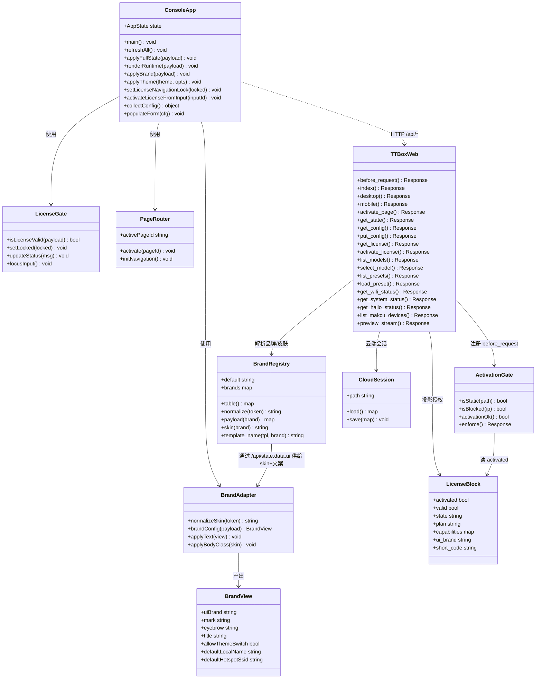
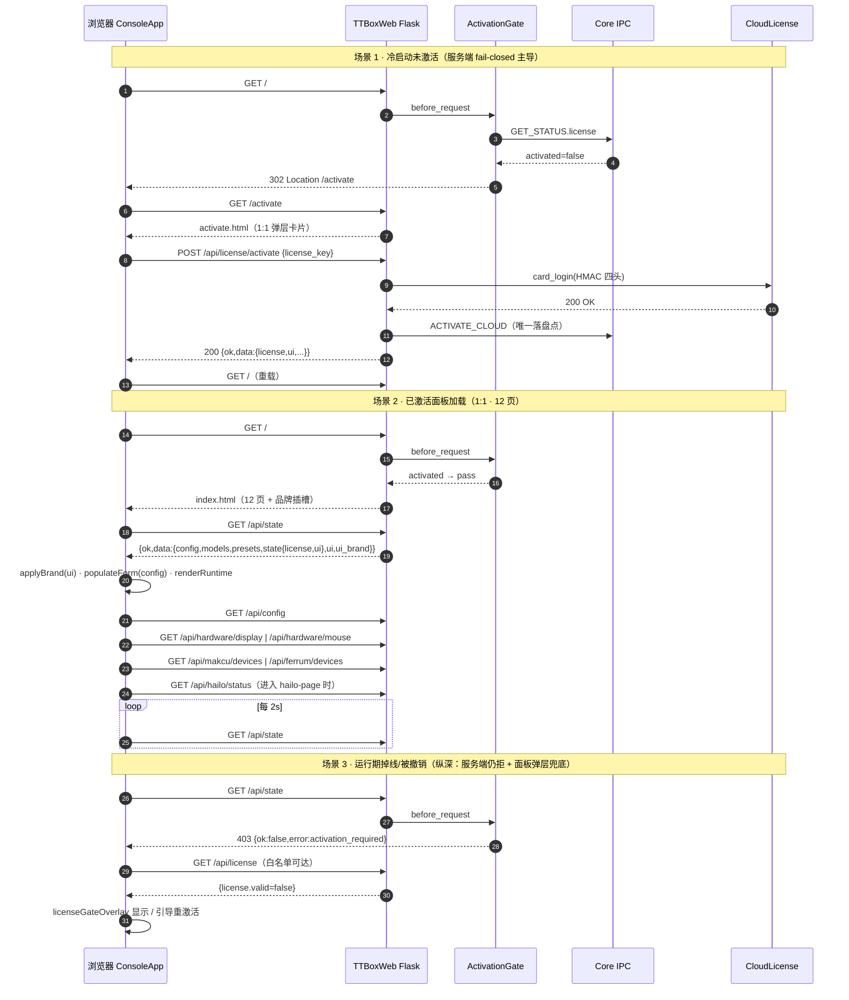
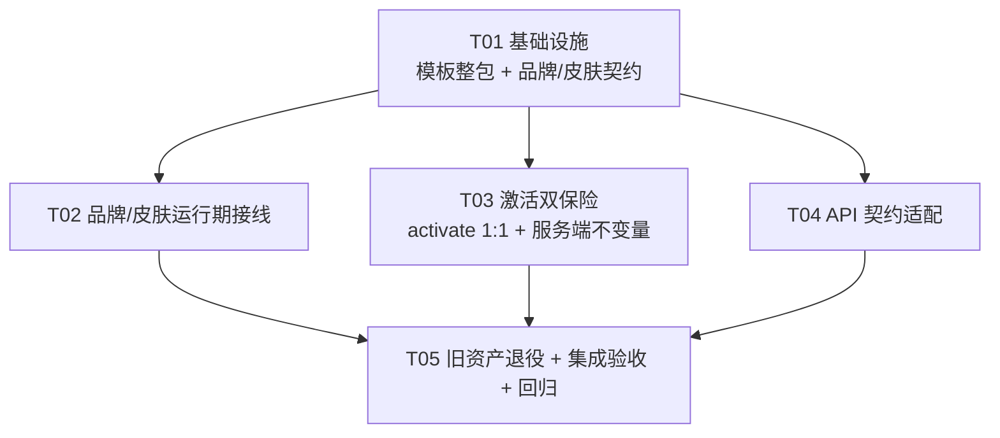

# 控制台 1:1 采用上游 YU 控制台 — 架构设计 + 任务分解

- **文档类型**：架构设计 + 任务分解（一次给全）
- **作者**：架构师 高见远（software-architect-3）
- **日期**：2026-09-18
- **仓库根**：`C:\Users\Administrator\Desktop\TTBOX-Module-Edition-main`
- **参照物**：`C:\Users\Administrator\Desktop\index.html`（16059 行 / 534KB，零外链自包含单文件）
- **性质**：**只读侦察 + 设计**，本文件不含代码改动；实现交给软件工程师。

---

## 0. 侦察核实结论（事实基线）

| # | 核实项 | 结论 | 证据 |
|---|---|---|---|
| 0.1 | `/console` 路由是否存在 | **不存在（陈旧注释）** | `bin/ttbox-web.py:1617` 注释「自研控制台 /console 已随产品决策整体删除，这里不再注册任何页面路由」；`api_v1.py:619-628` 同述；全仓 `grep '/console'` 仅命中注释，无 `@app.get`/`route` 注册。`1633` 行「新控制台挂在 /console」是与 1617 自相矛盾的**陈旧注释**，应删。 |
| 0.2 | 参照物 Jinja2 语法冲突 | **零冲突**（见 §1.2 实测） | `{{` / `{%` / `{#` 命中数均为 0 |
| 0.3 | 参照物 12 页签 | 确认 12 页 | `index.html:5215-5250`（nav）+ `5255..6350`（12 个 `section id=*-page`） |
| 0.4 | 参照物自带 3 皮肤 | 确认 yu(基) / xh / xcsh | `index.html:214,358,4984-5190`（`html[data-ui-brand=...]` 覆盖段） |
| 0.5 | 参照物内嵌激活弹层 | 确认存在 | `index.html:6500-6515` `#licenseGateOverlay`；行为在 `14664-14692` `setLicenseNavigationLock` |
| 0.6 | 参照物激活端点 | 与 TTBOX **同路径同入参** | 参照物 `index.html:12414` `POST /api/license/activate {license_key}` ≡ TTBOX `bin/ttbox-web.py:4286` |
| 0.7 | TTBOX 后端端点覆盖 | **50/50 全齐**（见 §4 清单） | 逐条比对 `bin/ttbox-web.py` 路由表 |
| 0.8 | 现网资产被测试断言 | **无测试断言 index.html/console.* 的内容** | 全仓 `grep` `read_text` 仅命中 `ttbox-web.py` 自身；见 §5 |
| 0.9 | `templates/<brand>/` 皮肤回退 | 目录不存在 ⇒ 走回退（行为正常） | `templates/` 仅 5 个 md-html，无品牌子目录 |
| 0.10 | `index-preview.html` | 无路由引用的**遗留模板** | 仅 `tests/test_web_continuous_lead.py:8` 注释与 `docs/product/TTBOX_WEB_FEATURE_MATRIX.md:210` 提及；`bin` 无 render |

---

# Part A · 系统设计

## 1. 实现方案

### 1.1 核心结论：采用策略 = **整包替换 `templates/index.html`**

参照物是**零外链自包含单文件**，满足"直接作为 Jinja2 模板渲染"的全部前提：

- 无 `<link>` / `<script src>` / `http(s)://` 外链 ⇒ 不依赖静态资源管线，替换后**不产生 404**；
- 字体全用系统字体栈（`Inter/Segoe UI/Noto Sans SC/PingFang SC/Microsoft YaHei`）⇒ 离线可跑；
- 属性驱动品牌（`data-ui-brand` / `data-brand-*`）⇒ 只需极少插槽即可接管 TTBOX 品牌。

**因此：不手工重写、不裁剪、不"精简对齐"——把参照物整包落地为 `plugins/web/templates/index.html`，再叠加品牌插槽与少量运行期适配。** 这正是用户"1:1 做不出来"的正面解法（M2.07 的 10 页手工重写版被否定的根因就是"手工重写必然走样"）。

### 1.2 Jinja2 语法冲突 — 实测结论（**零冲突，无需转义**）

**实测命令与结果**（Grep/ripgrep，针对 `C:\Users\Administrator\Desktop\index.html`）：

| 模式 | 命中 | 判定 |
|---|---|---|
| `\{\{`（Jinja 变量起始） | **0** | 无冲突 |
| `\{%`（Jinja 语句起始） | **0** | 无冲突 |
| `\{#`（Jinja 注释起始） | **0** | 无冲突 |
| `\{%\|\{\{\|\{#`（合并） | **0** | 无冲突 |
| `\{`（任意左花括号） | 3105 行 | 花括号大量存在，但**从不连续成 `{{`**（JS 对象字面量 `{ ... }` 均为单花括号） |
| `\$\{`（JS 模板字符串插值） | 约 **310 行** | `${...}` 与 Jinja **无语义交集**（Jinja 不解析 `$`） |

**确定结论**：
1. 参照物可**逐字节**作为 Jinja2 模板渲染，**无需** `` 包裹、**无需**转义、**无需**改渲染方式。
2. Flask 默认 `autoescape=True` **只作用于 `{{ ... }}` 的输出**；参照物内联 JS 里的 `& < >` 是**模板字面量**，不经 autoescape，**逐字节保留**。
3. 唯一的 `{{` 将来自**我们主动插入的品牌插槽**（见 §1.3），属**预期内**的、极少量、位置可控的注入。

**规避方案（备用，非必需）**：若后续上游升级引入 `{{`/`{%`，用 `...` 只包裹 `<script>...</script>` 整段（插槽留在 `<html>`/`<head>` 之外），即可零风险隔离。**本期不启用**，仅作为升级护栏写入共享知识（§8）。

### 1.3 品牌注入映射（保留 JS 从 `/api/state` 动态刷新）

**问题**：参照物 `applyBrand()`(`index.html:7017`) 的 `brandConfig()`(`6938`) 用**硬编码表**把 `ui_brand` 摊成文案（`yu→"YU 控制台"/AI`、`xh→"XH 系统"`、`xcsh→"XCSH 系统"`），并 `normalizeUiBrand()` **强制收敛到 {yu,xh,xcsh} 闭集**。这会**覆盖** TTBOX 注册表下发的 `brand_mark/brand_eyebrow/brand_title`。

**解法**：**分层**——闭集只用于"选皮肤"，文案永远来自服务端（单一真相源）。

- `ui_brands.json` 每条品牌条目新增可选字段 **`"skin": "yu" | "xh" | "xcsh"`**（缺省 `yu`）。
- 后端 `_ui_block()` 投影新增 **`skin`**；`_page_context()` 新增 **`ui_skin`**。
- 参照物内联 JS 的 `applyBrand/brandConfig` 做**最小改造**：`skin` 取 `payload.ui.skin`（缺省按 token 映射），文案取 `payload.ui.brand_mark/brand_eyebrow/brand_title`（**不再用硬编码文案**）；皮肤闭集归一**仅**作用于 `document.documentElement.dataset.uiBrand` 与 `body.ui-brand-*`。

**映射表（`ui_brand` → 皮肤 → 文案）**：

| TTBOX `ui_brand`（注册表） | 参照物 `data-ui-brand`（皮肤） | 皮肤来源 | `brand_mark` | `brand_eyebrow` | `brand_title` | `default_theme` | `allow_theme_switch` |
|---|---|---|---|---|---|---|---|
| `ttbox`（默认） | `yu` | `:root` 暗色基样式 | `TT` | `TTBOX SYSTEM` | `TTBOX 控制台` | `dark` | `true` |
| `sample`（示例渠道） | `xh` | `html[data-ui-brand="xh"]` | `SM` | `SAMPLE SYSTEM` | `SAMPLE 控制台` | `light` | `false` |
| *（预留第三渠道）* | `xcsh` | `html[data-ui-brand="xcsh"]` | 注册表 | 注册表 | 注册表 | `dark` | `false` |

**与既有机制的对齐**：
- 仓库 `ui_brands.json` 现为 **schema v2**，含 `ttbox` + `sample` 两条 ⇒ 新增 `skin` 字段即完成"3 皮肤 ↔ TTBOB 品牌"的数据驱动对齐（渠道新增皮肤 = 改一行 JSON，零代码）。
- **保留** `_brand_template_name()` 皮肤回退（`ttbox-web.py:671`）与 `templates/<brand>/` 机制——渠道包仍可整目录换皮，与 `data-ui-brand` 皮肤**互补**。
- **保留** `/api/state.data.ui` 的 `brand_mark/brand_eyebrow/brand_title/default_theme/allow_theme_switch` 与运行期 `applyBrand` 刷新（**不改** `_ui_block()` 既有字段，**只增不改**）。

### 1.4 激活流程双保险 — 评估与选定

**冲突本质**：参照物靠**客户端弹层** `#licenseGateOverlay`（`setLicenseNavigationLock`）表达"未激活"；TTBOX 靠**服务端** `before_request`（`ttbox-web.py:1481`）对 `/`、`/desktop`、`/mobile` **302 → /activate**（`_ACTIVATION_PAGES`，1438）。两者若并存，未激活用户根本到不了 `/`，弹层永不显示。

#### 案 A：`/` 不再 302，改由 `/api/state` 的 license 块驱动弹层

- **改动**：从 `_ACTIVATION_PAGES` 移除 `/`；`/api/state` 加入白名单（否则面板 JS 拿不到数据、弹层无法判定）。
- **致命问题（不是风格偏好，是硬阻断）**：现网回归测试**明确锁死**当前语义——
  - `tests/test_web_freeauth_gate.py:164` `test_unactivated_pages_redirect_to_activate`：断言 `/` 未激活 ⇒ **302**；
  - `tests/test_web_freeauth_gate.py:140` `test_unactivated_api_gate_403_activation_required`：断言 **`/api/state` 未激活 ⇒ 403**。
  案 A 需同时反转这两条 P0 断言。
- **安全退化**：白名单化 `/api/state` 会把 **config / models / presets / metrics / detection** 一并暴露给未授权客户端，直接违背 `_ACTIVATION_WHITELIST`（1424）"最小白名单"原则；且**未授权即可渲染整张控制面板**，正是"拒绝卡却放行"的历史病灶形态（F11）。
- **结论**：**否决**。

#### 案 B（✅ 选定）：保留 302，把参照物弹层样式用于激活页外观，执法路径**零改动**

- **服务端**：`_enforce_gate` / `_ACTIVATION_PAGES` / `_ACTIVATION_WHITELIST` **一行不改** ⇒ 302 + 403 双执法保持，P0 回归全绿。
- **客户端**：`/activate` 页（`templates/activate.html`）**重写为参照物 `#licenseGateOverlay` 卡片 1:1**（同文案「设备授权 / 输入激活码后继续使用」、同状态行、同 `激活码` 输入、同 `激活设备`+`刷新状态` 双按钮、同暗色卡片视觉）。结构 1:1，**执法路径不变**。
- **纵深（第二重）**：`index.html` 内**原样保留**上游 `#licenseGateOverlay` 标记 + CSS + JS（整包替换自动带入），其激活按钮**直连 `/api/license/activate`**（与上游同端点）。用途 = **运行期掉线/被撤销**时就地锁定（此时服务端已开始 403，弹层是"看得见"的兜底）。

#### 安全论证（为什么双保险不构成放行）

> **服务端始终是唯一放行判据**：前端弹层**只是呈现**，不改变任何授权判定。未激活时——
> ① 页面面：`/`、`/desktop`、`/mobile` ⇒ **302 /activate**（到不了面板，弹层无从绕过）；
> ② API 面：除白名单 5 类（`/api/license`、`/api/license/activate`、`/api/activation/network/prepare`、`/api/network/wifi*`、`/api/system`）外**一律 403 `activation_required`**。
> 即便攻击者用 devtools 强行 `overlay.hidden=true` / 删 DOM，**任一敏感 API 仍 403**，AI 链路与配置写入均不可达。
> 与 F11 教训的关系：F11 的病灶是**服务端状态被一次被拒请求污染**（core 侧，已由 core 1.4.3 修复）；本设计**不触碰**该路径，且**不新增**任何客户端可触发的放行闸门。

### 1.5 技术选型（**不引入框架 / CDN / 构建工具**）

| 层 | 选型 | 理由 |
|---|---|---|
| 模板 | Jinja2（Flask 内置） | 参照物零冲突，可直接渲染 |
| 前端 | 参照物内联原生 JS（整包） | 1:1 保真；无构建链 |
| 样式 | 参照物内联 `<style>`（整包） | 零外链，离线可用 |
| 后端 | 现有 Flask（`bin/ttbox-web.py`） | 50 端点已齐，仅需契约微调 |
| 品牌 | `config/ui_brands.json` 数据驱动 | 沿用 M2.04 v2 机制，只增 `skin` |

---

## 2. 文件清单（相对路径）

| # | 文件 | 动作 | 说明 |
|---|---|---|---|
| F1 | `plugins/web/templates/index.html` | **替换（整包）** | 参照物整包落地 + 3 处品牌插槽（`data-ui-brand` / `data-theme` / `<title>` / `body.ui-brand-*`）+ `applyBrand` 改造 |
| F2 | `plugins/web/templates/activate.html` | **重写** | 1:1 复刻 `#licenseGateOverlay` 卡片外观与交互（结构对齐、文案对齐） |
| F3 | `plugins/web/config/ui_brands.json` | 修改 | 每条品牌增 `"skin": "yu|xh|xcsh"` |
| F4 | `plugins/web/config/README.md` | 修改 | 同步 `skin` 字段文档 |
| F5 | `plugins/web/bin/ttbox-web.py` | 修改 | `_ui_block()` 增 `skin`；`_page_context()` 增 `ui_skin`；**按 §4 清单**补/调 API 字段；删陈旧注释（1617/1633） |
| F6 | `plugins/web/static/console.css` | **归档/删除** | 新面板不再引用（0 引用、0 测试断言） |
| F7 | `plugins/web/static/console.js` | **归档/删除** | 同上 |
| F8 | `plugins/web/templates/index-preview.html` | 归档/删除 | 无路由的遗留模板（§0.10） |
| F9 | `plugins/web/tests/test_web_brand.py` | 修改 | 增 `skin` 契约断言 |
| F10 | `plugins/web/tests/test_web_freeauth_gate.py` | 修改 | 增"双保险"回归（302 + 403 不变量） |
| F11 | `plugins/web/tests/test_web_console_parity.py` | **新增** | 模板 12 页/品牌插槽/弹层标记存在性回归 |
| F12 | `scripts/ttbox_m2xx_console_accept.py` | **新增** | 板端验收脚本（§7） |
| F13 | `docs/handover/2026-09-17/控制台1:1采用-架构设计-2026-09-18.md` | 新增 | 本文档 |
| F14 | `docs/handover/2026-09-17/class-diagram.mermaid` | 新增 | 类图（§3） |
| F15 | `docs/handover/2026-09-17/sequence-diagram.mermaid` | 新增 | 时序图（§4） |

---

## 3. 数据结构与接口（类图）



---

## 4. 程序调用流程（时序图）



---

## 5. 待明确事项（Anything UNCLEAR）

| # | 事项 | 现状/假设 | 需要谁拍板 |
|---|---|---|---|
| U1 | **第三渠道是否真用 `xcsh` 皮肤** | 本期只映射 `ttbox→yu`、`sample→xh`；`xcsh` 预留给未来 | 产品 |
| U2 | 参照物 `/api/state` 的**逐字段**契约（`payload.config.model_id` 是否顶层等） | 后端已含绝大多数字段；少量字段需板端实测对齐（§6 清单标 △/✗） | 工程师实测 |
| U3 | `console.css/console.js` 是**删除**还是**移入 `static/legacy/`** | 建议移入 `legacy/`（最小改动、可回滚）；仓库已有 `static/legacy/` 先例 | 主理人 |
| U4 | `/ui-custom.css`（designer）是否继续注入到新面板 | 参照物不引用它；designer 默认关闭。**假设**：本期不注入，保留端点常驻（无 404） | 主理人 |
| U5 | 无硬件页（Hailo/键鼠盒子）文案 | 后端已返回 `pcie.present=false` / `ready=false`；**假设**：面板显示"不可用"占位，不改上游页结构 | 产品 |
| U6 | 上游 `?activation=1` 语义 | 参照物只写不读（服务端渲染用途）；TTBOX 用 `/activate` 路由替代，**假设**：不实现 `?activation=1` | 主理人 |

---

# Part B · 任务分解

## 6. API 契约核对清单（50 端点）

**总判定**：TTBOX 后端 **50/50 端点全齐**（无缺失、无 404）。风险集中在**响应结构/字段名**。下表给出逐端点核对结果与修法；`△/✗` 项为工程师**必须板端实测对齐**的点。

> 核对方法（工程师执行）：`python3 plugins/web/bin/ttbox-web.py`（或板端起 8000）→ `curl -s /api/<x> | python3 -m json.tool` → 对照参照物消费点（`index.html:14430 refreshAll` / `14445 applyFullState` / `11192 renderRuntime` / `13242 renderModels` / `13538 renderPresets` / `13669/14015/14129` 等）。

| 组 | 端点 | 参照物消费点 | TTBOX 实现 | 判定 | 修法 |
|---|---|---|---|---|---|
| 状态 | `GET /api/state` | `14431 refreshAll`；`7210 isLicenseValid` 读 `data.state.license.valid`；`11214 license`；`11199 state.capture/detection/aim/latency/mouse_output/fan_control` | `1723`→`collect_web_state()` `1121` | **✓ 主结构对齐**（`{ok,data:{config,models,presets,state{...},ui,ui_brand}}`；`state.license.valid` 已由 `631` 别名提供） | `state.status` 含 `degraded`，参照物 `STATUS_LABELS`(`6536`) 无该键 ⇒ 补前端标签或后端映射 |
| 状态 | `GET /api/config` | `14448 populateForm(payload.config)` | `2094`→`profile_to_web` | △ | 逐 field 核对 `config.capture.*/ai.controller.*/aim_profiles[]` |
| 状态 | `PUT /api/config` | `bindConfigAutoApply` | `2065`→`web_body_to_profile` | △ | 核对 `aim_profiles[0]` 与 `recoil.*` 往返 |
| 状态 | `GET /api/announcement` | 公告弹层 | `1728` | ✓ | — |
| 系统 | `GET /api/system` | `collect` 资源/温度/主机名/uptime | `1736`→`collect_system_stats()` | △ | 核对 `cpu_percent/memory.percent/storage.percent/temperature.celsius/hostname/lan_ipv4/uptime_seconds` |
| 系统 | `PUT /api/system/hostname` | 系统页 | `1793` | ✓ | — |
| 系统 | `GET /api/system/storage` | 存储卡 | `1754` | ✓ | 含 `free/percent/root_*`/`data_*` |
| 系统 | `POST /api/system/storage/expand` | 存储扩容 | `1784` | ✓ | — |
| 系统 | `PUT /api/system/web-port` | — | `1806` | ✓ | — |
| 系统 | `GET/POST/DELETE /api/system/lan-blocklist` | 网络页黑名单 | `1870/1892/1909` | ✓ | 读 `{blocked_ips\|ips}`（前端已兼容双键） |
| 系统 | `POST /api/system/lan-blocklist/scan` | 扫描 | `1876` | ✓ | — |
| 系统 | `POST /api/system/reboot` | 总览 | `2030` | ✓ | — |
| 系统 | `POST /api/system/poweroff` | 总览 | `2039` | ✓ | — |
| 系统 | `POST /api/system/reactivate` | — | `1916` | ✓ | — |
| 授权 | `GET /api/license` | `12332`；`12423 result.license` | `4281`→`_license_payload()` | **✓**（`license.valid/activated/capabilities/state/plan`；顶层 `ui`、`ui_brand`） | — |
| 授权 | `POST /api/license/activate` | `12414` `{license_key}` | `4286` | **✓ 同路径同入参** | — |
| 控制 | `POST /api/control/start` | 总览启动 | `3546` | ✓ | — |
| 控制 | `POST /api/control/stop` | 总览停止 | `3563` | ✓ | — |
| 硬件 | `GET /api/hardware/display` | `loadHardware` | `3926` | △ | 核对 `current/modes[].token/label` |
| 硬件 | `PUT /api/hardware/display` | 应用显示 | `4080` | ✓ | — |
| 硬件 | `GET /api/hardware/mouse` | `loadHardware` | `3672` | △ | 核对 `mode/modes/device.product` |
| 硬件 | `PUT /api/hardware/mouse/mode` | 应用鼠标 | `3865` | ✓ | — |
| 网络 | `GET /api/network/wifi` | 网络页 | `4162` | △ | 核对 `ssid/mode/networks[]` 与 wifi_manager 契约 |
| 网络 | `POST /api/network/wifi/scan` | 扫描 | `4167` | △ | 参照物可能读 `networks[]`；TTBOX 返回整体 status |
| 网络 | `POST /api/network/wifi/connect` | 连接 | `4172` | ✓ | `{ssid,password}` |
| 网络 | `POST /api/network/wifi/fallback` | 复位 | `4185` | ✓ | — |
| 网络 | `POST /api/network/wifi/ap/apply` | AP | `4193` | ✓ | — |
| 网络 | `POST /api/network/wifi/client/activate` | 客户端模式 | `4203` | ✓ | — |
| 模型 | `GET /api/models` | `13242 renderModels` | `2403` | **✓**（`{models:[{id,model_id,name,label,input_width,input_height,class_names,...}]}`） | 核对 `preset_name` 字段（参照物 `13541 currentModel().preset_name`） |
| 模型 | `POST /api/models/select` | `14694 applySelectedModel` | `2741` | ✗ | 参照物读 `result.config/models/presets/model`；TTBOX 现返回需**补齐这 4 个键** |
| 模型 | `POST /api/models/delete` | 模型页 | `2729` | ✓ | — |
| 模型 | `GET /api/models/device-code` | 模型页 | `2636` | ✓ | — |
| 模型 | `POST /api/models/import` | 导入 | `2671` | ✓ | — |
| 模型 | `POST /api/models/bind-preset` | 绑定预设 | `2764` | ✓ | — |
| 模型 | `POST /api/models/class-names` | 类别名 | `2859` | ✓ | — |
| 预设 | `GET /api/presets` | `renderPresets` | `2877` | **✓** | `{presets:[名字串]}`；参照物 `13539` 期望**字符串数组** ✓ |
| 预设 | `POST /api/presets` | 保存/删除/重命名 | `2885` | ✓ | `action:save\|delete\|rename` |
| 预设 | `POST /api/presets/load` | 加载 | `2919` | ✓ | — |
| 预设 | `POST /api/presets/import` | 导入 | `2952` | ✓ | — |
| Hailo | `GET /api/hailo/status` | `refreshHailoStatus` | `4457` | △ | 结构完整（`pcie.present=false/ready=false` ⇒ 显示"不可用"）；核对 `install/runtime/device` 字段 |
| Hailo | `POST /api/hailo/install` | 安装 | `4512` | ✓ | 无设备 ⇒ 400 + 完整状态（预期） |
| 键鼠 | `GET /api/makcu/devices` | `refreshMakcuDevices` | `4797` | ✓ | `{devices:[{path,vendor_id,model,backend}]}` |
| 键鼠 | `GET /api/ferrum/devices` | `refreshFerrumDevices` | `4823` | ✓ | — |
| 键鼠 | `GET /api/kmboxb/devices` | 键鼠盒子页 | `4828` | ✓ | — |
| 键鼠 | `POST /api/mouse-output/test-circle` | 画圆测试 | `4833` | **✗（预期）** | TTBOX 恒返 `ok:false`"请先启用外接盒子"；无盒子 ⇒ 前端提示即可，**不改** |
| 诊断 | `POST /api/diagnostics/aim-trace` | 诊断 | `3575` | ✓ | — |
| 诊断 | `GET /api/diagnostics/usb-proxy.zip` | 诊断下载 | `3628` | ✓ | — |
| 预览 | `GET /api/preview.mjpg` | `` | `4868` | ✓ | MJPEG 流；`/api/state.state.preview_path` 亦提供 |
| 更新 | `POST /api/update/install` | OTA | `1986` | ✓ | — |
| 更新 | `GET /api/update/status` | OTA 状态 | `1992` | ✓ | — |
| 更新 | `GET /api/update/versions` | 版本列表 | `2014` | ✓ | 无后端能力 ⇒ 400 `not_supported`（测试已锁） |
| 更新 | `GET /api/update/check` | 检查更新 | `2020` | ✓ | 同上 |
| 更新 | `POST /api/update/cleanup-stuck` | 清理卡死 | `2025` | ✓ | — |

**不一致项汇总（需修）**：**✗×2**（`/api/models/select` 补 4 键；`test-circle` 属设备预期）、**△×7**（state.status 标签、config、system、hardware×2、wifi×2、hailo）。其余 **✓×41**。

**修法原则**：**优先"后端补字段"**（前端 1:1 参照物不得大改）；仅当字段语义冲突时才在前端加薄适配。

---

## 7. 回归风险清单

### 7.1 测试断言影响（**无测试读取旧 HTML/CSS/JS 内容**）

| 测试文件 | 涉旧资产？ | 具体断言/行号 | 换模板/换资产影响 |
|---|---|---|---|
| `tests/test_web_brand.py` | 否（只测 Python 纯函数） | `:202/:205/:208/:214` 断言 `_brand_template_name('index.html'/'mobile.html'/'activate.html')`（**函数级**，不读文件内容）；`:266` `len(ctx['module_labels'])==12` | **不受影响**（新模板仍需 `_page_context` 提供同名键）。⚠ 但 `:266` 锁死"12 个模块标签" = **12 页签的隐性契约**，新面板须保持 12 页 |
| `tests/test_web_freeauth_gate.py` | 否 | `:98-101` `/setup`/`/login` 404；`:164-172` 未激活 `/`⇒302、`/activate`⇒200；`:175-178` 已激活三端⇒200；`:140-147` 未激活 `/api/state`⇒403 | **不受影响**——但**正是"双保险"必须保绿的 P0 断言**（案 A 会打破，故选案 B） |
| `tests/test_web_model_input.py` | 否（纯函数） | — | 不受影响 |
| `tests/test_web_cloud_client.py` | 否（lib 单测） | — | 不受影响 |
| `tests/test_web_continuous_lead.py` | 否（纯函数） | 仅注释提及 `index-preview.html:8` | 不受影响（`index-preview.html` 归档后**注释需同步**以免误导） |
| `tests/test_web_license_caps.py` | 否 | — | 不受影响 |
| `tests/test_web_calibration_apply.py` / `test_web_recoil_translation.py` | 否 | — | 不受影响 |

> **门禁注意**：`test_web_freeauth_gate.py:91` 有 **grep 门禁**，禁用词 `first-setup|_RL_ACTIVATE|scrypt|_SESSION_COOKIE|_hash_password|api_auth_login` 不得出现在 `ttbox-web.py`。改动须避开这些字面量（**注释里也不能写**）。

### 7.2 旧资产处置（最小改动原则）

| 资产 | 引用方 | 处置 | 理由 |
|---|---|---|---|
| `static/console.css` | 仅旧 `index.html` | **移入 `static/legacy/`**（不建议直接删） | 0 测试断言；`legacy/` 已有先例；可回滚 |
| `static/console.js` | 仅旧 `index.html` | 同上 | 同上 |
| `templates/index-preview.html` | 无路由（仅注释） | 移入归档或删除 | §0.10；同步 `test_web_continuous_lead.py:8` 注释 |
| `templates/<brand>/` 皮肤回退 | `_brand_template_name` | **保留不动** | 与 `data-ui-brand` 皮肤互补；测试 `:192-214` 依赖该函数 |
| `/console` 路由 | 不存在 | 仅删**陈旧注释**（`1617/1633`） | 无代码影响 |
| `/ui-custom.css` + `/designer` | designer 默认关闭 | **保留端点常驻**（返回空串，无 404） | 见 U4 |

---

## 8. 共享知识 / 跨文件约定

**通用约定**
- 所有 `/api/*` 响应统一 `{ok: bool, data?: any, error?: str}`（**HTTP 200 也可能 `ok:false`** —— 前端必须同时判 `!response.ok || data.ok===false`，与参照物 `7502 api()` 一致）。
- 未激活执法语义（**不可更改**）：页面 302 `/activate`；API 403 `{"ok":false,"error":"activation_required"}`；白名单 = `/api/license`、`/api/license/activate`、`/api/activation/network/prepare`、`/api/system`、`/api/network/wifi*`。
- 黑名单 403 `{"ok":false,"error":"blocked"}`，只认 `remote_addr`。
- 品牌单一真相源：`_ui_block()`（← `ui_brands.json` ← 签名卡 `ui_brand`）。**禁止**在模板/JS 内再硬编码品牌文案。
- 品牌闭集归一**只用于"选皮肤"**；文案永远来自服务端 `payload.ui.*`。
- 皮肤闭集 `{yu, xh, xcsh}`；缺省 `yu`；未知 token ⇒ `yu`。
- 日期一律 ISO 8601（`_unix_to_iso`）；前端展示北京时间串由云端 `expire_at` 提供。
- 静态资源 URL 不含 `..`/`\`/`%2e`；页面与 API 一律 `Cache-Control: no-store`（`after_request`）。
- 本仓 **无构建链**：禁止新增 npm/CDN/打包器；模板内联为唯一交付形态。
- **Jinja 升级护栏**：若上游未来引入 `{{`/`{%`/`{#`，用 `…` 只包裹 `<script>` 段（插槽留在其外）。

**`_page_context()` 契约（模板可用变量）**

```json
{
  "app_title": "TTBOX 控制台",
  "ui_brand": "ttbox",
  "ui_skin": "yu",              // 新增：映射到参照物 data-ui-brand
  "brand_mark": "TT",
  "brand_eyebrow": "TTBOX SYSTEM",
  "brand_title": "TTBOX 控制台",
  "default_theme": "dark",
  "allow_theme_switch": true,
  "brand_static_prefix": "",
  "brand_has_custom_skin": false,
  "asset_version": "2026.09.13.1",
  "module_labels": ["...12 项..."]
}
```

**`/api/state.data.ui` 契约（新增 `skin`，其余只增不改）**

```json
{
  "ui_brand": "ttbox",
  "skin": "yu",
  "brand_name": "TTBOX",
  "brand_mark": "TT",
  "brand_eyebrow": "TTBOX SYSTEM",
  "brand_title": "TTBOX 控制台",
  "app_title": "TTBOX 控制台",
  "default_theme": "dark",
  "allow_theme_switch": true,
  "brand_accent": "#2F81F7",
  "brand_logo": null,
  "theme": {"mode": "dark", "accent": "#2F81F7"},
  "default_local_name": "ttbox",
  "default_hotspot_ssid": "TTBOX",
  "fallback_reset_text": "重置默认 Wi-Fi"
}
```

**模板插槽（F1 内 4 处，其余逐字节保留）**

```html
<html lang="zh-CN" data-ui-brand="{{ ui_skin }}" data-theme="{{ default_theme }}">
<title>{{ app_title }}</title>
<body class="license-loading ui-brand-{{ ui_skin }}">
```

**JS 改造点（`applyBrand`，最小侵入）**

```js
// 皮肤：payload.ui.skin（缺省按 token 归一）；文案：payload.ui.brand_*（服务端单一真相源）
function applyBrand(payload) {
  const ui = (payload && payload.ui) || {};
  const skin = normalizeSkin(ui.skin || ui.ui_brand || payload.ui_brand);
  document.documentElement.dataset.uiBrand = skin;
  document.body.classList.toggle("ui-brand-yu",   skin === "yu");
  document.body.classList.toggle("ui-brand-xh",   skin === "xh");
  document.body.classList.toggle("ui-brand-xcsh", skin === "xcsh");
  setText("brandMark",    ui.brand_mark    || "TT");
  setText("brandEyebrow", ui.brand_eyebrow || "TTBOX SYSTEM");
  setText("brandTitle",   ui.brand_title   || "TTBOX 控制台");
  document.title = ui.app_title || ui.brand_title || "TTBOX 控制台";
  applyTheme(ui.default_theme === "light" ? "light" : "dark", { persist: false });
  const toggle = $("themeToggleButton"); if (toggle) toggle.hidden = !ui.allow_theme_switch;
}
```

---

## 9. 依赖包

**无第三方新增依赖**（约束：Python Flask + 原生 JS，无构建链、无 CDN）。

| 运行时 | 依赖 | 说明 |
|---|---|---|
| 后端 | Flask（既有） | Jinja2 内置 |
| 前端 | 无 | 参照物内联 CSS/JS 自包含 |
| 测试 | pytest（既有） | `plugins/web/tests/*` |
| 板端验收 | Python 标准库 + curl | `scripts/ttbox_m2xx_console_accept.py` |

---

## 10. 有序任务列表（**5 个任务，硬上限内**）

> 说明：全队共用一个 `software-engineer`，任务按**实现顺序**串行；`templates/index.html` 是唯一热点文件（T01 建立、T02 接线），约定**同一时刻单一写者**。

### T01 — 项目基础设施：模板整包落地 + 品牌/皮肤后端契约 【P0】
- **源文件**：`plugins/web/templates/index.html`（整包替换）、`plugins/web/config/ui_brands.json`（+`skin`）、`plugins/web/config/README.md`、`plugins/web/bin/ttbox-web.py`（`_ui_block`+`skin`、`_page_context`+`ui_skin`、删 1617/1633 陈旧注释）
- **依赖**：无
- **要点**：① 参照物逐字节落地；② 仅 4 处品牌插槽（`data-ui-brand`/`data-theme`/`<title>`/`body.ui-brand-*`）；③ `ui_brands.json` 增 `skin`（ttbox→yu、sample→xh）；④ **不改** `_ACTIVATION_PAGES`/白名单；⑤ 自检 Jinja 渲染无 `UndefinedError`。
- **验收**：`/` `/desktop` `/mobile` 渲染 200 且含 12 个 `section.-page` 与 `#licenseGateOverlay`；`pytest plugins/web/tests/test_web_brand.py`

### T02 — 品牌/皮肤运行期接线（内联 JS）【P0】
- **源文件**：`plugins/web/templates/index.html`（`applyBrand/brandConfig/normalizeSkin` + `body.ui-brand-*` + theme toggle + 占位符注入 `lanHostnameInput/wifiApSsid/wifiFallbackButton`）、`plugins/web/tests/test_web_brand.py`（+`skin` 断言）
- **依赖**：T01
- **要点**：闭集只选皮肤；**文案全部取 `payload.ui.*`**；`data-brand-top` 三元素运行期刷新；主题切换随 `allow_theme_switch` 隐藏。
- **验收**：`_page_context`/`/api/state.data.ui` 的 `skin` 与 `brand_*` 一致；切品牌后侧栏文案/皮肤同步。

### T03 — 激活双保险：`/activate` 1:1 弹层卡片 + 面板弹层兜底 + 服务端执法不变量【P0】
- **源文件**：`plugins/web/templates/activate.html`（重写为 `#licenseGateOverlay` 卡片 1:1）、`plugins/web/templates/index.html`（`licenseGateOverlay` 激活按钮直连 `/api/license/activate`；`setLicenseNavigationLock` 接线）、`plugins/web/bin/ttbox-web.py`（**保持** 302/403，仅加不变量注释）、`plugins/web/tests/test_web_freeauth_gate.py`（增双保险回归）
- **依赖**：T01
- **要点**：**服务端一行不改**；`/activate` 卡片结构与文案 1:1；面板弹层用于运行期锁定；**断网/devtools 绕过弹层亦 403**。
- **验收**：未激活 `/`⇒302、`/api/state`⇒403；`/activate`⇒200 且卡片元素齐；激活按钮 POST 成功。

### T04 — API 契约适配（state/config/models/presets/wifi/system/hardware/hailo）【P1】
- **源文件**：`plugins/web/bin/ttbox-web.py`（`/api/models/select` 补 `config/models/presets/model` 4 键；`state.status` 标签映射；按 §6 △ 项核对补字段）、`plugins/web/templates/index.html`（薄适配）、`plugins/web/tests/test_web_model_input.py`（+往返用例）
- **依赖**：T01
- **要点**：**优先后端补字段**；前端只做兼容读（双键）；`/api/mouse-output/test-circle` 保持"无盒子报错"语义。
- **验收**：§6 清单 ✗/△ 项全部实测转 ✓ 或明确标注"设备预期"。

### T05 — 旧资产退役 + 集成验收 + 回归【P1】
- **源文件**：`plugins/web/static/console.css`、`plugins/web/static/console.js`（移入 `static/legacy/`）、`plugins/web/templates/index-preview.html`（归档）、`plugins/web/tests/test_web_console_parity.py`（新增）、`scripts/ttbox_m2xx_console_accept.py`（新增）、`docs/handover/2026-09-17/*`（同步）
- **依赖**：T01、T02、T03、T04
- **要点**：归档旧资产（不删，最小改动）；新增 12 页/插槽/弹层存在性回归；无 404 核查；板端验收脚本；同步 `test_web_continuous_lead.py:8` 注释。
- **验收**：`pytest plugins/web/tests/` 全绿；验收脚本 12 项全过。

---

## 11. 任务依赖图



---

## 12. 板端验收清单（交 QA · `software-qa-engineer`）

> 目标板：RK3588 / 香橙派 AI 瞄准盒子（TTBOX）。执行：`scripts/ttbox_m2xx_console_accept.py`（T05 产出）+ 手工抽查。

| # | 验收项 | 判据 | 关联任务 |
|---|---|---|---|
| A1 | **12 页渲染** | `/` 侧栏 12 个 `module-tab` 与 12 个 `section id=*-page` 一一对应；逐页点开无 JS 报错 | T01/T02 |
| A2 | **品牌随卡** | 改签名卡 `ui_brand` ⇒ 侧栏 `brandMark/brandEyebrow/brandTitle` 与 `data-ui-brand` 皮肤随之变化；`brand_*` 取自服务端 | T01/T02 |
| A3 | **激活弹层 + fail-closed** | 未激活：`/`⇒302 `/activate`、`/api/state`⇒403 `activation_required`；`/activate` 卡片与 `#licenseGateOverlay` 结构/文案 1:1；**devtools 删弹层后仍 403** | T03 |
| A4 | **无 404** | 首屏 Network 面板：无 404（含 CSS/JS/img/API）；`/ui-custom.css` 返回 200 空串 | T01/T05 |
| A5 | **预览可用** | 总览页 `#previewImage` 加载 `/api/preview.mjpg` 有画面；断流时 `state.preview.alive=false` | T01/T04 |
| A6 | **无硬件页占位** | `hailo-page` 显示"不可用"（`pcie.present=false`）；`kmbox-page` 无盒子时显式提示；**不得 500/白屏** | T04 |
| A7 | **旧测试全绿** | `pytest plugins/web/tests/` 全部通过（含 freeauth gate 302/403 不变量、brand 12 标签、**grep 门禁**） | T02/T03/T04 |
| A8 | **品牌皮肤回退** | `templates/<brand>/index.html` 存在时换皮生效、缺失时静默回退（`_brand_template_name` 不回归） | T01 |
| A9 | **黑名单执法** | 封禁 IP ⇒ 403 `blocked`（网络层功能不回归） | T03 |
| A10 | **无构建链** | 全文件零 `<link>`/`<script src>` 外联、零 CDN、零 `http(s)://` 资源 | T01 |

---

## 13. 交付摘要（回主理人）

- **采用策略**：✅ **整包替换** `templates/index.html`；Jinja2 实测 **零冲突**（`{{`/`{%`/`{#` 命中均为 0），**无需** ``/转义；仅 4 处品牌插槽。
- **品牌映射**：`ui_brands.json` 增 `skin`（`ttbox→yu`、`sample→xh`、预留 `xcsh`）；**闭集只选皮肤、文案取服务端** `payload.ui.*`；保留 `/api/state` 运行期刷新。
- **激活双保险**：✅ 选 **案 B**——**服务端 302+403 一行不改**（P0 回归全绿），`/activate` 重写为 `#licenseGateOverlay` 卡片 1:1，面板内保留上游弹层作运行期兜底；**服务端为唯一放行判据**。案 A 因打破两条 P0 断言 + 白名单扩大被否。
- **API 差异**：50/50 端点全齐；**✗2**（`/api/models/select` 补 4 键；`test-circle` 属设备预期）+ **△7**（state.status、config、system、hardware×2、wifi×2、hailo）需实测；其余 **✓41**。
- **回归风险**：**无测试读取旧 HTML/CSS/JS 内容**；关键不变量 = `test_web_freeauth_gate` 的 302/403 与 grep 门禁、`test_web_brand:266` 的"12 标签"。旧 `console.*` 建议移入 `static/legacy/`（不删）。
- **任务列表**：**5 个任务**（T01 基础设施 → T02 品牌接线 / T03 激活双保险 / T04 API 适配 → T05 退役+验收），每任务 ≥3 文件。
- **待明确**：6 项（U1 第三渠道皮肤、U2 state 逐字段、U3 console.* 处置方式、U4 `/ui-custom.css` 是否注入、U5 无硬件页文案、U6 `?activation=1` 是否实现）。

---

*（本文件由架构师高见远产出，只读侦察、不含代码改动。）*
